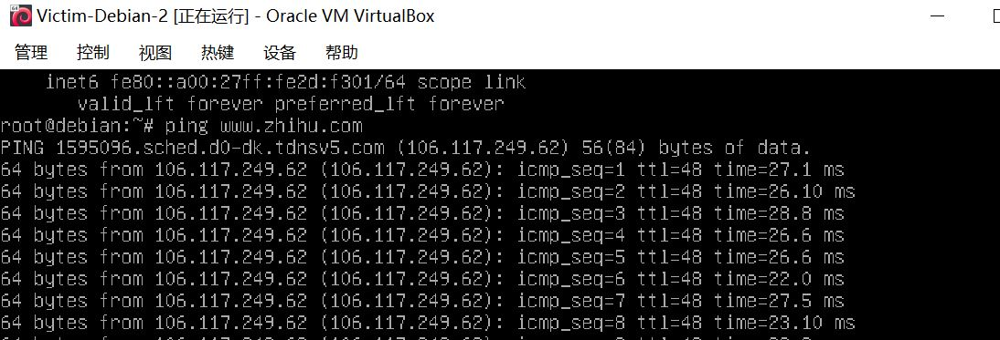
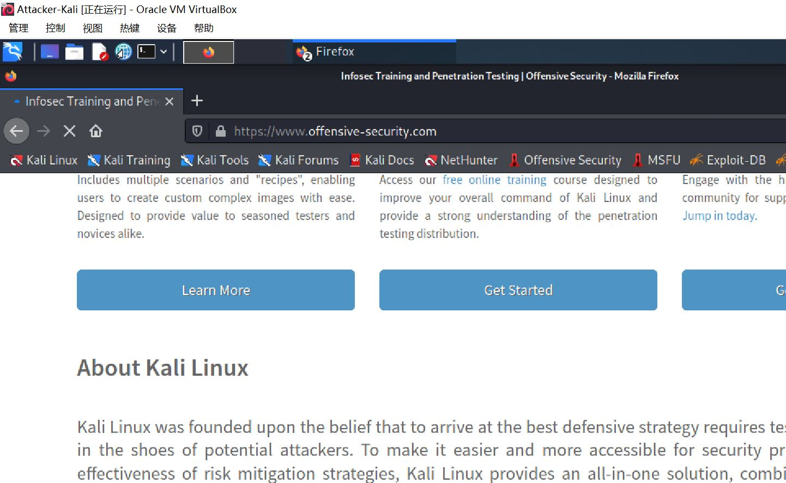

# 实验一

#  基于 VirtualBox 的网络攻防基础环境搭建

## 实验目的

- 掌握VirtualBox 虚拟机的安装与使用；
- 掌握VirtualBox 的虚拟网络类型和按需配置；
- 掌握VirtualBox 的虚拟硬盘多重加载；

## 实验环境

- VirtualBox 虚拟机
- 攻击者主机（Attacker）：Kali Rolling 2109.2
- 网关（Gateway，GW）：Debian Buster
- 靶机（Victim）：From Sqli to shell / xp-sp3 / Kali

## 实验内容

- 创建虚拟机

  

- 设置网络

  - Gateway网络

    

    

  - Gateway具体网卡1~4

    

    

    

    

- Attacker-Kali网络

  

- Victim-Kali-1网络

  

- Victim-XP-1网络

  

- Victim-Debian-2网络

  

- Victim-XP-2网络

  

- 为内部网络添加地址

  

- **网络连通性测试**

  - 靶机可以直接访问攻击者主机

    

  - 

  - 

  - 

  - 攻击者主机无法直接访问靶机

    

  - 

  - 

  - 

  - 网关可以直接访问攻击者主机

    

  - 网关可以直接访问靶机

    

  - 

  - 

  - 

  - 靶机的所有对外上下行流量必须经过网关

    - 抓包

      

    - Wireshark分析数据包

      

  - 所有节点均可以访问互联网

    

  

  

## 实验步骤

- 打开VirtualBox
- 创建虚拟机并搭建网络拓扑
- 各台机子之间互相ping
- 抓包并分析
- 写实验报告

## 问题&&解决方法

- 使用ssh连接用户root输入正确密码后，报错`Permission denied, please try again.`
  - 解决方法：[修改ssh配置文件给予root用户权限](https://cloud.tencent.com/developer/article/1454777)
- ICMP协议可达，但关掉xp系统的防火墙，也ping不同
  - 解决方法：更改Windows防火墙设置 → 添加例外
- 虚拟机切换到NAT网络时，出现无效设置
  - 解决方法：[解决虚拟机NAT网络无效设置问题](https://jingyan.baidu.com/article/a3f121e4850c98fc9052bb97.html)
- 从虚拟机复制文件到电脑桌面报错 `scp: /home/package/20210911.1.pcap: Not a directory`
  - 正确命令：`scp: /home/package` 用Wireshark直接打开package即可

​           

- 在虚拟机中，若文件不能放在某个用户底下，则 `mkdir 文件名` 另创文件夹存放

- 打开虚拟机时报错 `Locking of attached media failed. A possible reason is that one of the media is attached to a running VM`

  - 解决方法：[将虚拟硬盘设置为多重加载](https://blog.csdn.net/Jeanphorn/article/details/45056251?ops_request_misc=%257B%2522request%255Fid%2522%253A%2522163141656116780262546766%2522%252C%2522scm%2522%253A%252220140713.130102334..%2522%257D&request_id=163141656116780262546766&biz_id=0&utm_medium=distribute.pc_search_result.none-task-blog-2~all~sobaiduend~default-1-45056251.first_rank_v2_pc_rank_v29&utm_term=VirtualBox%E5%A4%9A%E9%87%8D%E5%8A%A0%E8%BD%BD&spm=1018.2226.3001.4187)

  

  

  

