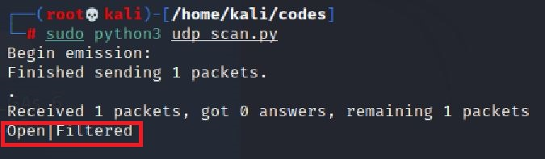

# 基于Scapy编写端口扫描器

## 实验目的

- 掌握网络扫描之端口状态探测的基本原理

## 实验环境

- Linux Kali
- python + scapy

## 实验要求

- [x] 禁止探测互联网上的 IP ，严格遵守网络安全相关法律法规
- [x] TCP connect scan / TCP stealth scan
- [x] TCP Xmas scan / TCP fin scan / TCP null scan
- [x] UDP scan
- [x] 上述每种扫描技术的实现测试均需要测试端口状态为：`开放`、`关闭` 和 `过滤` 状态时的程序执行结果
- [x] 提供每一次扫描测试的抓包结果并分析与课本中的扫描方法原理是否相符？如果不同，试分析原因；
- [x] 在实验报告中详细说明实验网络环境拓扑、被测试 IP 的端口状态是如何模拟的
- [x] (可选）复刻 `nmap` 的上述扫描技术实现的命令行参数开关

## 实验步骤

- 阅读实验要求
- 搭建网络拓扑
- 编写python代码
- 进行抓包并截图
- 编写实验报告

## 实验原理及命令

### Scapy基础

```python
# 导入模块
from scapy.all import *
# 查看包信息
pkt = IP(dst="")
ls(pkt)
pkt.show()
summary(pkt)
# 发送数据包
send(pkt)  # 发送第三层数据包，但不会受到返回的结果。
sr(pkt)  # 发送第三层数据包，返回两个结果，分别是接收到响应的数据包和未收到响应的数据包。
sr1(pkt)  # 发送第三层数据包，仅仅返回接收到响应的数据包。
sendp(pkt)  # 发送第二层数据包。
srp(pkt)  # 发送第二层数据包，并等待响应。
srp1(pkt)  # 发送第二层数据包，并返回响应的数据包
# 监听网卡
sniff(iface="wlan1",count=100,filter="tcp")
# 应用：简单的SYN端口扫描 （测试中）
pkt = IP("...")/TCP(dport=[n for n in range(22, 3389)], flags="S")
ans, uans = sr(pkt)
ans.summary() # flag为SA表示开放，RA表示关闭
```

### 发送命令

`TCP connect scan` 与 `TCP stealth scan` 都是先发送一个`S`，然后等待回应。如果有回应且标识为`RA`，说明目标端口处于关闭状态；如果有回应且标识为`SA`，说明目标端口处于开放状态。这时

- `TCP connect scan`会回复一个RA，在完成三次握手的同时断开连接
- `TCP stealth scan`只回复一个R，不完成三次握手，直接取消建立连接

`TCP Xmas scan、TCP fin scan`及`TCP null scan`不涉及三次交互。它们都是先发送一个包，然后根据目标主机是否回复`R`来目标端口的状态。不同的是：

- TCP Xmas scan发送的是`FPU`
- TCP fin scan发送的是`F`
- TCP null scan发送的包里没有设置任何flag

UDP是无连接的协议，通过发送`UDP+port`得到的回复确定被扫描主机的状态。

- Open：`no response / server responds to the client with a UDP packet`；
- Closed：`ICMP error type 3 and code 3`
- filtered：`no response / ICMP error type 3 and code 1,2,3,9,10,13`。

### ufw

作用：控制端口的打开、关闭和过滤

```
#打开/关闭防火墙
sudo ufw enable/disable
```

### 端口

检测端口状态

```
sudo netstat -lnp | grep port-num
```

端口设为过滤状态

```
sudo ufw deny port-num
```

### namp

扫描tcp

```
sudo nmap [-sT/sX/sS] ip-address
```

扫描udp

```
sudo namp -sU ip-address
```


## 实验内容

### 网络拓扑

沿用前几次实验的网络构造，使用子网`intnet1`，网关`Gateway`，扫描端`Sent Kali`，被扫描靶机`Recevie`


### 准备工作

#### 端口状态模拟

- **扫描端Sent初态**

  

- 在靶机Recevie上安装ufw、dnsmasq

  ```
  #更新
  sudo apt-get update 
  #安装防火墙
  sudo apt-get install ufw
  #安装dnsmasq
  sudo apt-get install dnsmasq
  ```

- **靶机Recevie状态**

  - 关闭状态：对应端口未开启监听和防火墙

    ```
    ufw disable
    systemctl stop apache2 # 关闭端口80
    systemctl stop dnsmasq # 关闭端口53
    ```

    

  - 开启状态：对应端口开启监听， 防火墙处于关闭状态。

    ```
    systemctl start apache2 # 开启端口80 → apache2基于TCP, 在80端口提供服务
    systemctl start dnsmasq # 开启端口53 → DNS服务基于UDP,在53端口提供服务
    ```

    

  - 过滤状态：对应端口开启监听, 防火墙开启。

    ```
    ufw enable && ufw deny 80/tcp
    ufw enable && ufw deny 53/udp
    ```

    

- 在扫描端主机Sent安装增强功能，开启双向拖放功能

- 将编辑好的python文件拖入主机Sent

  

### 开始扫描

**TCP connect scan** 

- 开放

  ```
  ufw disable #防火墙关闭
  systemctl start apache2 #开启端口80
  systemctl status apache2 #查看端口80的状态
  ```

  - 联机抓包结果 （靶机）

    ```
    sudo tcpdump -i eth0 -enp -w connect_open.pcap
    ```

    

  - 代码测试运行结果 （扫描端）

    ```
    sudo python3 tcp_connect_scan.py
    ```

    

    

  - nmap复刻的结果 （扫描端）

    ```
    nmap -sT -p 80 172.16.111.140#靶机ip地址
    ```

    

- 关闭
  
  ```
  ufw disable #防火墙关闭
  systemctl stop apache2 #开启端口80
  systemctl status apache2 #查看端口80的状态
  ```
  
  
  
  - 联机抓包结果（靶机）
  
    ```
    sudo tcpdump -i eth0 -enp -w connect.closed.pcap
    ```
  
    
  
  - 代码测试运行结果 （扫描端）
  
    ```
    sudo python3 tcp_connect_scan.py
    ```
  
    
  
    
  
  - nmap复刻的结果（扫描端）
  
    ```
    nmap -sT -p 80 172.16.111.140#靶机ip地址
    ```
  
    
  
- 过滤
  
  ```
  ufw enable && ufw deny 80/tcp #开启防火墙
  
  systemctl start apache2 #开启端口80
  systemctl status apache2 #查看端口80的状态
  ```
  
  
  
  - 联机抓包结果（靶机）
  
    ```
    sudo tcpdump -i eth0 -enp -w connect.filtered.pcap
    ```
  
    
  
  - 代码测试运行结果（扫描端）
  
    ```
    sudo python3 tcp_connect_scan.py
    ```
  
    
  
    
  
  - nmap复刻的结果（扫描端）
  
    ```
    nmap -sT -p 80 172.16.111.140#靶机ip地址
    ```
  
    

**TCP stealth scan**

- 开放

  ```
  ufw disable #防火墙关闭
  systemctl start apache2 #开启端口80
  systemctl status apache2 #查看端口80的状态
  ```

  - 联机抓包结果（靶机）

    ```
    sudo tcpdump -i eth0 -enp -w stealth.open.pcap
    ```

    

  - 代码测试运行结果（扫描端）

    ```
    sudo python3 tcp_stealth_scan.py
    ```

    

    

  - nmap复刻的结果（扫描端）

    ```
    nmap -sS -p 80 172.16.111.140 #靶机ip地址
    
    ```

    

- 关闭
  
  ```
  ufw disable #防火墙关闭
  systemctl stop apache2 #开启端口80
  systemctl status apache2 #查看端口80的状态
  ```
  
  
  
  - 联机抓包结果（靶机）
  
    ```
    sudo tcpdump -i eth0 -enp -w stealth.closed.pcap
    ```
  
    
  
  - 代码测试运行结果（扫描端）
  
    ```
    sudo python3 tcp_stealth_scan.py
    ```
  
    
  
    
  
  - nmap复刻的结果（扫描端）
  
    ```
    nmap -sS -p 80 172.16.111.140 #靶机ip地址
    ```
  
    
  
- 过滤
  
  ```
  ufw enable && ufw deny 80/tcp #开启防火墙
  
  systemctl start apache2 #开启端口80
  systemctl status apache2 #查看端口80的状态
  ```
  
  
  
  - 联机抓包结果（靶机）
  
    ```
    sudo tcpdump -i eth0 -enp -w stealth.filtered.pcap
    ```
  
    
  
  - 代码测试运行结果（扫描端）
  
    ```
    sudo python3 tcp_stealth_scan.py
    ```
  
    
  
    
  
  - nmap复刻的结果（扫描端）
  
    ```
    nmap -sS -p 80 172.16.111.140 #靶机ip地址
    ```
  
    

**TCP Xmas scan** 

- 开放

  ```
  ufw disable #防火墙关闭
  systemctl start apache2 #开启端口80
  systemctl status apache2 #查看端口80的状态
  ```

  

  - 联机抓包结果（靶机）

    ```
    sudo tcpdump -i eth0 -enp -w Xmas.open.pcap
    ```

    

  - 代码测试运行结果（扫描端）

    ```
    sudo python3 tcp_Xmas_scan.py
    ```

    

    

  - nmap复刻的结果（扫描端）

    ```
    nmap -sX -p 80 172.16.111.140 #靶机ip地址
    
    ```

    

- 关闭
  
  ```
  ufw disable #防火墙关闭
  systemctl stop apache2 #开启端口80
  systemctl status apache2 #查看端口80的状态
  ```
  
  
  
  - 联机抓包结果（靶机）
  
    ```
    sudo tcpdump -i eth0 -enp -w Xmas.closed.pcap
    ```
  
    
  
  - 代码测试运行结果（扫描端）
  
    ```
    sudo python3 tcp_Xmas_scan.py
    ```
  
    
  
    
  
  - nmap复刻的结果（扫描端）
  
    ```
    nmap -sX -p 80 172.16.111.140 #靶机ip地址
    ```
  
    
  
- 过滤
  
  ```
  ufw enable && ufw deny 80/tcp #开启防火墙
  
  systemctl start apache2 #开启端口80
  systemctl status apache2 #查看端口80的状态
  ```
  
  
  
  - 联机抓包结果（靶机）
  
    ```
    sudo tcpdump -i eth0 -enp -w Xmas.filtered.pcap
    ```
  
    
  
  - 代码测试运行结果（扫描端）
  
    ```
    sudo python3 tcp_Xmas_scan.py
    ```
  
    
  
  - nmap复刻的结果（扫描端）
  
    ```
    nmap -sX -p 80 172.16.111.140 #靶机ip地址
    ```
  
    

**TCP fin scan** 

- 开放

  ```
  ufw disable #防火墙关闭
  systemctl start apache2 #开启端口80
  systemctl status apache2 #查看端口80的状态
  ```

  

  - 联机抓包结果（靶机）

    ```
    sudo tcpdump -i eth0 -enp -w fin.open.pcap
    ```

    

  - 代码测试运行结果（扫描端）

    ```
    sudo python3 tcp_fin_scan.py
    ```

    

    

  - nmap复刻的结果（扫描端）

    ```
    nmap -sF -p 80 172.16.111.140 #靶机ip地址
    
    ```

    

- 关闭
  
  ```
  ufw disable #防火墙关闭
  systemctl stop apache2 #开启端口80
  systemctl status apache2 #查看端口80的状态
  ```
  
  
  
  - 联机抓包结果（靶机）
  
    ```
    sudo tcpdump -i eth0 -enp -w fin.closed.pcap
    ```
  
    
  
  - 代码测试运行结果（扫描端）
  
    ```
    sudo python3 tcp_fin_scan.py
    ```
  
    
  
    
  
  - nmap复刻的结果（扫描端）
  
    ```
    nmap -sF -p 80 172.16.111.140 #靶机ip地址
    ```
  
    
  
- 过滤
  
  ```
  ufw enable && ufw deny 80/tcp #开启防火墙
  
  systemctl start apache2 #开启端口80
  systemctl status apache2 #查看端口80的状态
  ```
  
  
  
  - 联机抓包结果（靶机）
  
    ```
    sudo tcpdump -i eth0 -enp -w fin.filtered.pcap
    ```
  
    
  
  - 代码测试运行结果（扫描端）
  
    ```
    sudo python3 tcp_fin_scan.py
    ```
  
    
  
    
  
  - nmap复刻的结果（扫描端）
  
    ```
    nmap -sF -p 80 172.16.111.140 #靶机ip地址
    ```
  
    

**TCP null scan**

- 开放

  ```
  ufw disable #防火墙关闭
  systemctl start apache2 #开启端口80
  systemctl status apache2 #查看端口80的状态
  ```

  

  - 联机抓包结果（靶机）

    ```
    sudo tcpdump -i eth0 -enp -w null.open.pcap
    ```

    

  - 代码测试运行结果（扫描端）

    ```
    sudo python3 tcp_null_scan.py
    ```

    

    

  - nmap复刻的结果（扫描端）

    ```
    nmap -sN -p 80 172.16.111.140 #靶机ip地址
    
    ```

    

- 关闭
  
  ```
  ufw disable #防火墙关闭
  systemctl stop apache2 #开启端口80
  systemctl status apache2 #查看端口80的状态
  ```
  
  
  
  - 联机抓包结果（靶机）
  
    ```
    sudo tcpdump -i eth0 -enp -w null.closed.pcap
    ```
  
    
  
  - 代码测试运行结果（扫描端）
  
    ```
    sudo python3 tcp_null_scan.py
    ```
  
    
  
    
  
  - nmap复刻的结果（扫描端）
  
    ```
    nmap -sN -p 80 172.16.111.140 #靶机ip地址
    ```
  
    
  
- 过滤
  
  ```
  ufw enable && ufw deny 80/tcp #开启防火墙
  
  systemctl start apache2 #开启端口80
  systemctl status apache2 #查看端口80的状态
  ```
  
  
  
  - 联机抓包结果（靶机）
  
    ```
    sudo tcpdump -i eth0 -enp -w null.filtered.pcap
    ```
  
    
  
  - 代码测试运行结果（扫描端）
  
    ```
    sudo python3 tcp_null_scan.py
    ```
  
    
  
    
  
  - nmap复刻的结果（扫描端）
  
    ```
    nmap -sN -p 80 172.16.111.140 #靶机ip地址
    ```
  
    

**UDP scan**

- 开放

  ```
  ufw disable #防火墙关闭
  systemctl start dnsmasq #开启端口53
  systemctl status dnsmasq #查看端口53的状态
  ```

  

  - 联机抓包结果（靶机）

    ```
    sudo tcpdump -i eth0 -enp -w udp.open.pcap
    ```

    

  - 代码测试运行结果（扫描端）

    ```
    sudo python3 udp_scan.py
    ```

    

    

  - nmap复刻的结果（扫描端）

    ```
    nmap -sU -p 53 172.16.111.140 #靶机ip地址
    
    ```

    

- 关闭
  
  ```
  ufw disable #防火墙关闭
  systemctl stop dnsmasq #开启端口53
  systemctl status dnsmasq #查看端口53的状态
  ```
  
  
  
  - 联机抓包结果（靶机）
  
    ```
    sudo tcpdump -i eth0 -enp -w udp.closed.pcap
    ```
  
    
  
  - 代码测试运行结果（扫描端）
  
    ```
    sudo python3 udp_scan.py
    ```
  
    
  
    
  
  - nmap复刻的结果（扫描端）
  
    ```
    nmap -sU -p 53 172.16.111.140 #靶机ip地址
    ```
  
    
  
- 过滤
  
  ```
  ufw enable && ufw deny 53/udp #开启防火墙
  
  systemctl start dnsmasq #开启端口53
  systemctl status dnsmasq #查看端口53的状态
  ```
  
  
  
  - 联机抓包结果（靶机）
  
    ```
    sudo tcpdump -i eth0 -enp -w udp.filtered.pcap
    ```
  
    
  
  - 代码测试运行结果（扫描端）
  
    ```
    sudo python3 udp_scan.py
    ```
  
    
  
  - nmap复刻的结果（扫描端）
  
    ```
    nmap -sU -p 53 172.16.111.140 #靶机ip地址
    ```
  
    

## 问题及解决方法

- 执行命令 `sudo apt-get update` 

  **报错**：`W: Failed to fetch http://http.kali.org/kali/dists/kali-rolling/InRelease  Could not connect to http.kali.org:80 (192.99.200.113), connection timed out`
  `W: Some index files failed to download. They have been ignored, or old ones used instead.`

  **分析**：需要更换软件源，可换成

  阿里源：`deb http://mirrors.aliyun.com/kali kali-rolling main contrib non-free`

  清华源：`deb http://mirrors.tuna.tsinghua.edu.cn/kali kali-rolling main contrib non-free`

  

  **解决方法**:

  ```
  sudo su #进入root用户
  sudo vim/etc/apt/sources.list #编辑远程源文件
  
  #注释所有内容，往文件中添加以下内容
  deb http://mirrors.tuna.tsinghua.edu.cn/kali kali-rolling main contrib non-free
  ```

  [编辑apt-get远程源文件](https://www.cnblogs.com/061713xlhj/p/10726590.html)

## 参考资料

https://github.com/CUCCS/2020-ns-public-LyuLumos/tree/ch0x05/ch0x05

[课件](https://c4pr1c3.gitee.io/cuc-ns/)

