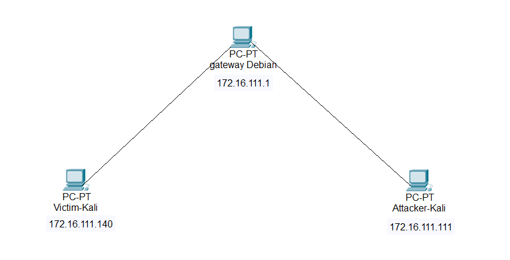
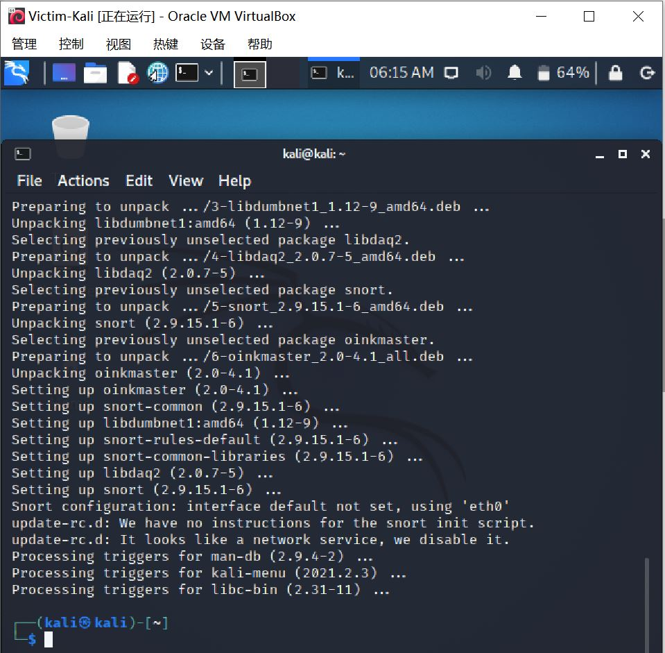
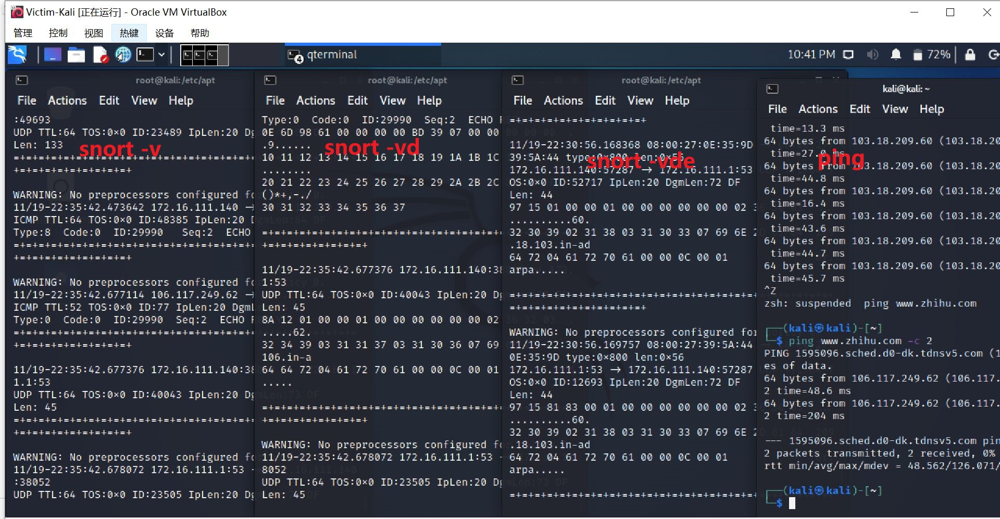
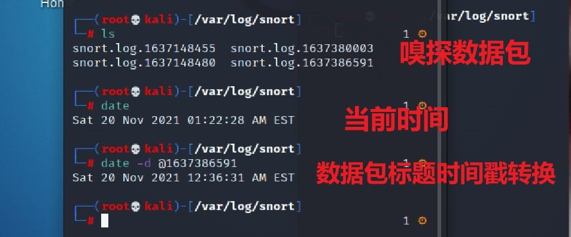
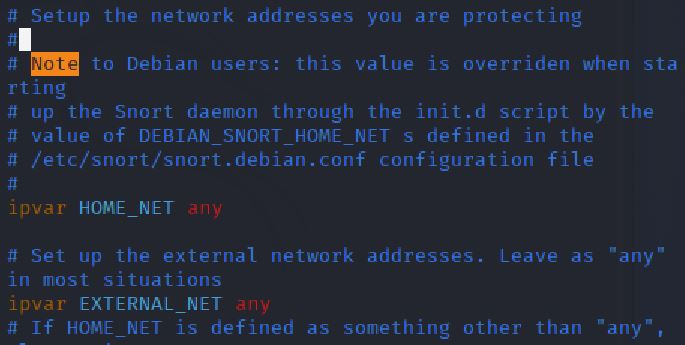
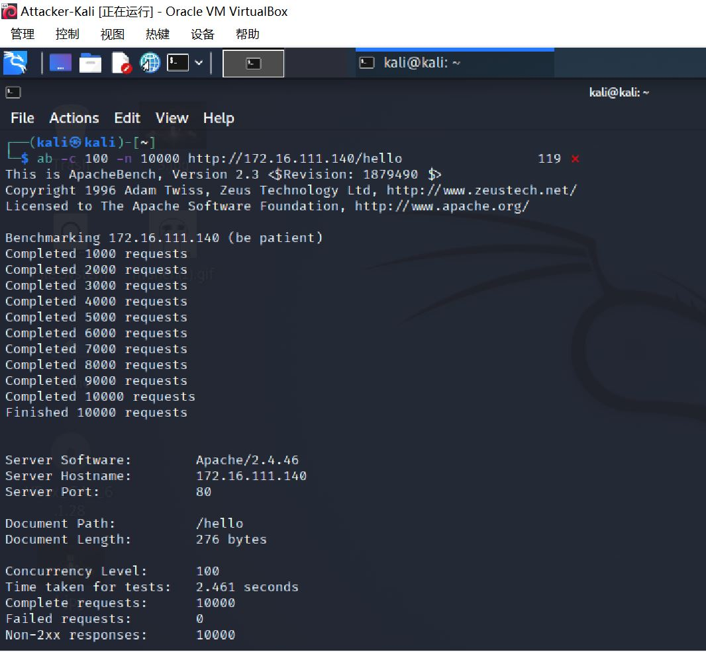
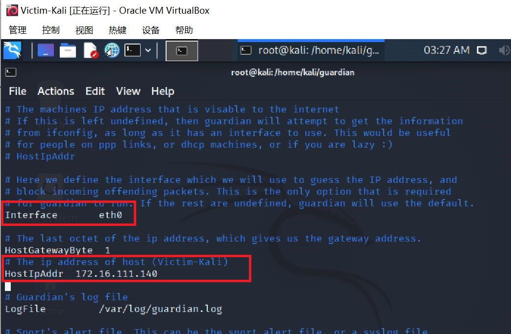
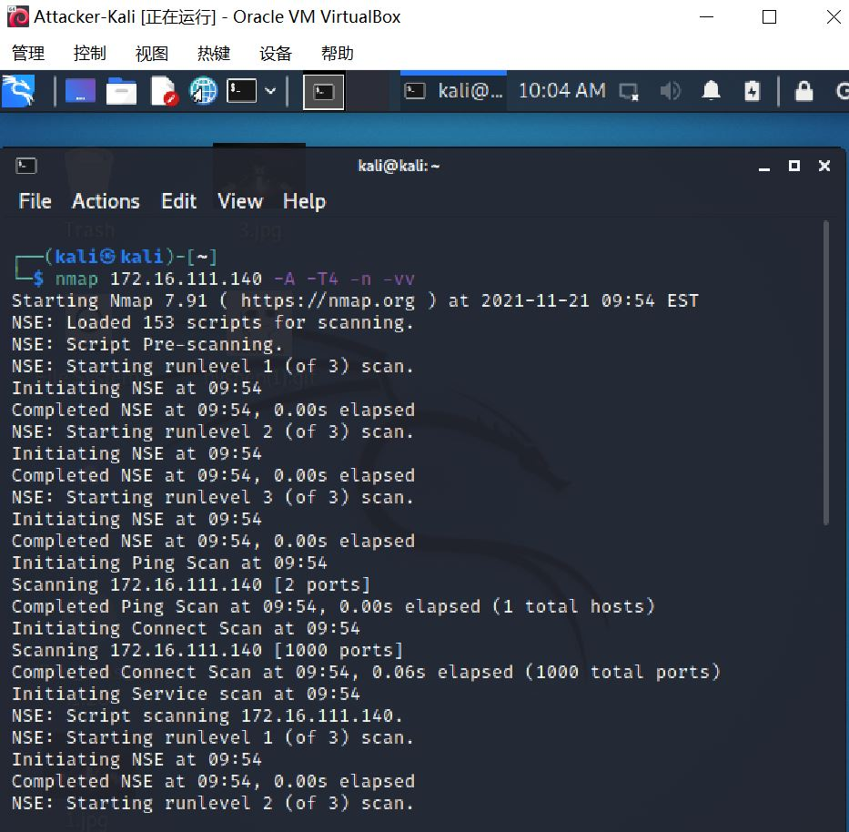

# 入侵检测

## 实验环境

- Oracle VM VirtualBox
- Linux Debian、Kali

**网络拓扑**



**Snort安装**

```
# 禁止在apt安装时弹出交互式配置界面
export DEBIAN_FRONTEND=noninteractive
# 在Victim上安装snort
sudo apt-get update && apt-get install snort
```



## 实验目的

- 熟悉并掌握防护环境的搭建
- 掌握入侵检测

## 实验步骤

- 阅读实验要求
- 配置实验环境
- 开始实验
- 截图并保存结果
- 编写实验报告并提交

## 实验内容

###  实验一：配置snort为嗅探模式

```
# 显示IP/TCP/UDP/ICMP头
snort –v

# 显示应用层数据
snort -vd

# 显示数据链路层报文头
snort -vde

#ping2次知乎的ip地址
ping www.zhihu.com -c 2

# -b 参数表示报文存储格式为 tcpdump 格式文件
# -q 静默操作，不显示版本欢迎信息和初始化信息
snort -q -v -b -i eth0 "port not 22"
```




```
# 使用 CTRL-C 退出嗅探模式
# 嗅探到的数据包会保存在 /var/log/snort/snort.log.<epoch timestamp>
# 其中<epoch timestamp>为抓包开始时间的UNIX Epoch Time格式串
# 可以通过命令 date -d @<epoch timestamp> 转换时间为人类可读格式
# exampel: date -d @1511870195 转换时间为人类可读格式
# 上述命令用tshark等价实现如下：
tshark -i eth0 -f "port not 22" -w 1_tshark.pcap
```



### 实验二：配置并启用snort内置规则 

```
# /etc/snort/snort.conf 中的 HOME_NET 和 EXTERNAL_NET 需要正确定义
# 例如，学习实验目的，可以将上述两个变量值均设置为 any
snort -q -A console -b -i eth0 -c /etc/snort/snort.conf -l /var/log/snort/
```



### 实验三：自定义snort规则

**在Victim-Kali执行以下命令**

```
# 新建自定义 snort 规则文件
vim /etc/snort/rules/cnss.rules

# $EXTERNAL_NET：替换为Attacker-kali的ip地址172.16.111.111
# $HTTP_SERVERS：替换为Victim-kali的ip地址172.16.111.140

alert tcp 172.16.111.111 any -> 172.16.111.140 80 (msg:"Access Violation has been detected on /etc/passwd ";flags: A+; content:"/etc/passwd"; nocase;sid:1000001; rev:1;)

alert tcp 172.16.111.111 any -> 172.16.111.140 80 (msg:"Possible too many connections toward my http server"; threshold:type threshold, track by_src, count 100, seconds 2; classtype:attempted-dos; sid:1000002; rev:1;)
```

```
# 添加配置代码到 /etc/snort/snort.conf
include $RULE_PATH/cnss.rules
```

```
# 开启apache2
service apache2 start

# 应用规则开启嗅探
snort -q -A fast -b -i eth0 -c /etc/snort/snort.conf -l /var/log/snort/
```

**在Attackter-Kali执行以下命令**

```
# 在Attacker-Kali上使用ab命令进行压力测试
# $dst_ip替换为Victim-Kali的ip地址：172.16.111.140

ab -c 100 -n 10000 http://172.16.111.140/hello
```



### 实验四：和防火墙联动

**在Victim-Kali执行以下命令**

将Guardian-1.7.tar.gz在主机解压缩后，拖入虚拟机Victim-Kali

```
# 安装 Guardian 的依赖 lib
sudo apt-get update
sudo apt-get install libperl4-corelibs-perl
```

在Victim上先后开启 **snort**和 **guardian.pl**

```
# 开启 snort
snort -q -A fast -b -i eth0 -c /etc/snort/snort.conf -l /var/log/snort/
```

编辑 guardian.conf 并保存，并更改参数为

```
HostIpAddr      172.16.111.140 # Victim-Kali主机的ip地址
Interface       eth0
```



```
# 启动 guardian.pl
perl guardian.pl -c guardian.conf
```

**在Attackter-Kali执行以下命令**

在Attack上用 `nmap` 暴力扫描 Victim：

```
nmap 172.16.111.140 -A -T4 -n -vv
```

guardian.conf 中默认的来源IP被屏蔽时间是 60 秒（屏蔽期间如果黑名单上的来源IP再次触发snort报警消息，则屏蔽时间会继续累加60秒）

```
root@KaliRolling:~/guardian# iptables -L -n
Chain INPUT (policy ACCEPT)
target     prot opt source               destination
REJECT     tcp  --  192.168.56.101       0.0.0.0/0            reject-with tcp-reset
DROP       all  --  192.168.56.101       0.0.0.0/0

Chain FORWARD (policy ACCEPT)
target     prot opt source               destination

Chain OUTPUT (policy ACCEPT)
target     prot opt source               destination

# 1分钟后，guardian.pl 会删除刚才添加的2条 iptables 规则
root@KaliRolling:~/guardian# iptables -L -n
Chain INPUT (policy ACCEPT)
target     prot opt source               destination

Chain FORWARD (policy ACCEPT)
target     prot opt source               destination

Chain OUTPUT (policy ACCEPT)
target     prot opt source               destination
```



### 实验思考题

1. IDS与防火墙的联动防御方式相比IPS方式防御存在哪些缺陷？是否存在相比较而言的优势？

   - IDS通过软、硬件，对网络、系统的运行状况进行监视，尽可能发现各种攻击企图、攻击行为或者攻击结果，以保证网络系统资源的机密性、完整性和可用性。

   - IPS是一部能够监视网络或网络设备的网络资料传输行为的计算机网络安全设备，能够即时的中断、调整或隔离一些不正常或是具有伤害性的网络资料传输行为。

2. 使用 Suricata 代替 Snort ， 重复本实验。

   未完成。

3. 配置 Suricata 为 IPS 模式，重复 `实验四` 。

   未完成。

## Q&A

1. **报错**：ERROR: Can't start DAQ (-1) - socket: Operation not permitted!
   Fatal Error, Quitting..

   **解决方法**：在`snort -v`前加上**sudo**！

2. **报错**：ERROR: /etc/snort/rules/cnss.rules(2) Unable to process the IP address: \$EXTERNAL_NET.
   Fatal Error, Quitting...

   **解决方法：**分别修改$EXTERNAL_NET、$HTTP_SERVERS为Attacker、Victim的主机ip地址

   ```
   alert tcp $EXTERNAL_NET any -> $HTTP_SERVERS 80 (msg:"Access Violation has been detected on /etc/passwd ";flags: A+; content:"/etc/passwd"; nocase;sid:1000001; rev:1;)
   alert tcp $EXTERNAL_NET any -> $HTTP_SERVERS 80 (msg:"Possible too many connections toward my http server"; threshold:type threshold, track by_src, count 100, seconds 2; classtype:attempted-dos; sid:1000002; rev:1;)
   ```


## 参考资料

- [师姐的作业](https://github.com/CUCCS/2020-ns-public-LyuLumos/blob/ch0x09/ch0x09/README.md)
- [在线课本第九章实验](https://c4pr1c3.gitee.io/cuc-ns/chap0x09/exp.html)
- [snort+guardian防护环境搭建](https://blog.csdn.net/m0_37570820/article/details/106398026?ops_request_misc=%257B%2522request%255Fid%2522%253A%2522163750678716780357218564%2522%252C%2522scm%2522%253A%252220140713.130102334.pc%255Fall.%2522%257D&request_id=163750678716780357218564&biz_id=0&utm_medium=distribute.pc_search_result.none-task-blog-2~all~first_rank_ecpm_v1~rank_v31_ecpm-1-106398026.first_rank_v2_pc_rank_v29&utm_term=guardian_block.sh%E6%96%87%E4%BB%B6%E9%85%8D%E7%BD%AE&spm=1018.2226.3001.4187)
- [snort的安装、配置和使用](https://wittpeng.blog.csdn.net/article/details/85088090)

